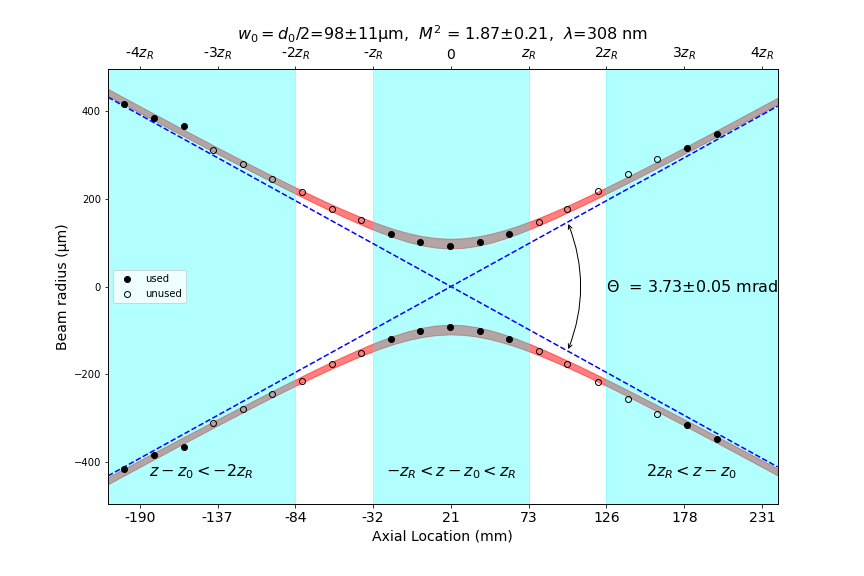

laserbeamsize
=============

Simple and fast calculation of beam sizes from a single monochrome image based
on the ISO 11146 method of variances.  Some effort has been made to make the 
algorithm less sensitive to background offset and noise.

Extensive documentation about backgrounds, integrations, and other issues can be found at
at <https://laserbeamsize.readthedocs.io>

Installation
------------

Just use pip::

   pip install laserbeamsize

Usage
-----

Finding the center and dimensions of a good beam image::

    import imageio
    import numpy as np
    import laserbeamsize as lbs

    beam = imageio.imread("t-hene.pgm")
    x, y, dx, dy, phi = lbs.beam_size(beam)

    print("The center of the beam ellipse is at (%.0f, %.0f)" % (x,y))
    print("The ellipse diameter (closest to horizontal) is %.0f pixels" % dx)
    print("The ellipse diameter (closest to   vertical) is %.0f pixels" % dy)
    print("The ellipse is rotated %.0f° ccw from the horizontal" % (phi*180/3.1416))

    ellipticity = dy/dx
    if ellipticity>0.87:
        print()
        print("The beam is circular because the ellipticity=%.2f > 0.87")
        print("The circular beam diameter is %.0f pixels" % np.sqrt((dx**2+dy**2)/2))

Alternatively, one can get a quick visual report::

    lbs.beam_size_plot(beam)
    plt.show()
    
Which will show

.. image:: hene-report.png

Alternatively::

    # read a monochrome image file (each value needs to be shifted 4 bits)
    tem02 = imageio.imread("TEM02_100mm.pgm") >> 4
    lbs.M2_diameter_plot(tem02, title = r"TEM$_{02}$ at z=100mm", pixel_size=3.75)
    plt.show()

Creates

.. image:: tem02.png

Determining M² for a laser beam is also straightforward.  Collect beam diameters from
five beam locations within one Rayleigh distance of the focus and from five locations more
than two Rayleigh distances::

    lambda1=308e-9
    z1_all=np.array([-200,-180,-160,-140,-120,-100,-80,-60,-40,-20,0,20,40,60,80,99,120,140,160,180,200])*1e-3
    d1_all=2*np.array([416,384,366,311,279,245,216,176,151,120,101,93,102,120,147,177,217,256,291,316,348])*1e-6
    lbs.M2_radius_plot(z1_all, d1_all, lambda1, strict=True)
    plt.show()

Produces

License
--------

`laserbeamsize` is licensed under the terms of the MIT license.
