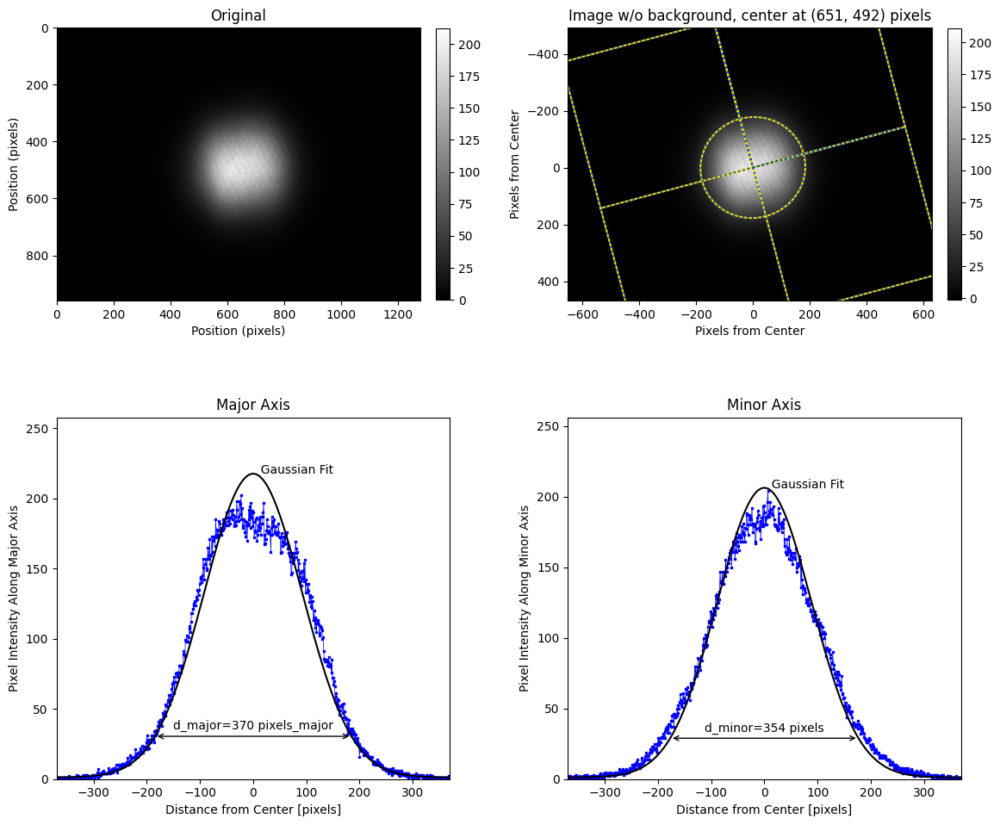

laserbeamsize
=============

Simple and fast calculation of beam sizes from a single monochrome image based
on the ISO 11146 method of variances.  Some effort has been made to make the 
algorithm less sensitive to background offset and noise.

Installation
------------

Just use pip::

   pip install laserbeamsize

Usage
-----

Finding the center and dimensions of a good beam image::

    import imageio
    import numpy as np
    import laserbeamsize as lbs

    beam = imageio.imread("t-hene.pgm")
    x, y, dx, dy, phi = lbs.beam_size(beam)

    print("The center of the beam ellipse is at (%.0f, %.0f)" % (x,y))
    print("The ellipse diameter (closest to horizontal) is %.0f pixels" % dx)
    print("The ellipse diameter (closest to   vertical) is %.0f pixels" % dy)
    print("The ellipse is rotated %.0f° ccw from the horizontal" % (phi*180/3.1416))

    ellipticity = dy/dx
    if ellipticity>0.87:
        print()
        print("The beam is circular because the ellipticity=%.2f > 0.87")
        print("The circular beam diameter is %.0f pixels" % np.sqrt((dx**2+dy**2)/2))

Alternatively, one can get a quick visual report::

    lbs.visual_report(beam)
    plt.show()
    
Which will show something like

  
Documentation about backgrounds, integrations, and other issues are explained 
at <https://laserbeamsize.readthedocs.io>

License
--------

laserbeamsize is licensed under the terms of the MIT license.
